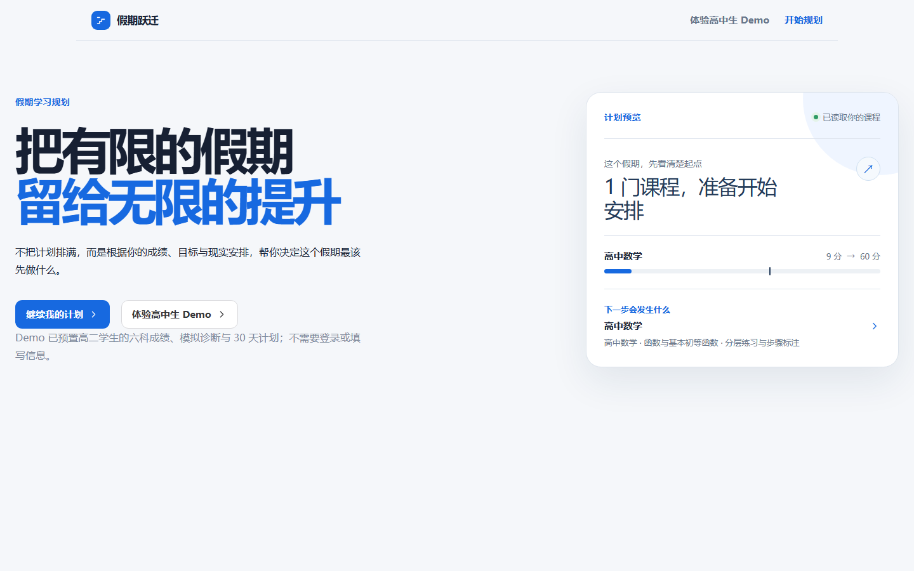
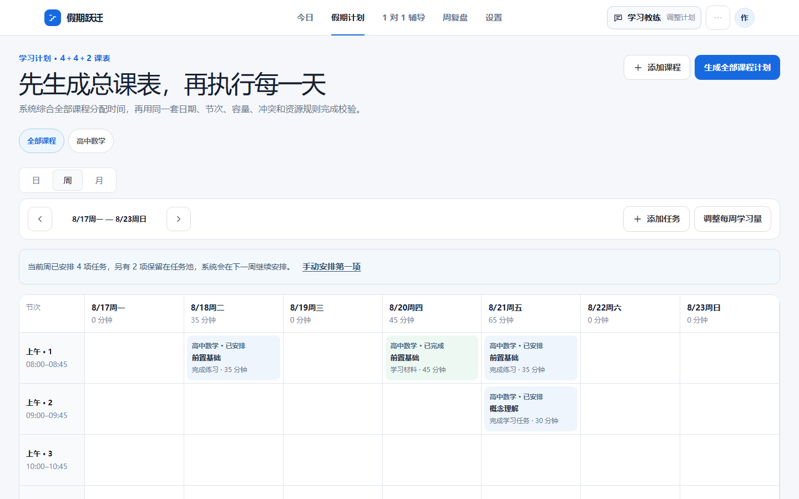

# AI Learning Planner · 假期跃迁

AI Learning Planner（中文名：假期跃迁）是一个面向高中生与大学生的本地优先个人学习系统（Personal Learning System）。它不把重点放在“多生成几个任务”，而是帮助学习者在有限假期内判断：**什么应该先做、为什么这样安排，以及计划被打断后如何继续。**

> 这是一个可运行的 AI 产品设计作品集 Demo。当前 AI、计划与资源服务均为明确标记的本地 mock provider，不需要 API Key，也不代表远程模型已接入。

## 5 分钟理解产品

### 用户问题

学生刚结束期末，可能同时面对低分课程、升学考试、技能提升和旅行安排。普通待办清单可以记录任务，却不能回答“有限时间里先做什么”，也不能在计划被打断后给出可解释、可撤销的下一步。

### 产品回答

用户提供课程事实、成绩或自评、目标与现实安排，系统依次完成：

`学习概况 → 课程诊断 → 优先级判断 → 阶段任务与任务池 → 周课表 → 今日执行 → 学习证据 → 周复盘 → 计划恢复`

核心分层是：

- 学习阶段决定“学什么”；
- Task Pool 保存尚未安排或需要重新安排的任务；
- Weekly Schedule 决定“什么时候学”；
- Plan Recovery 根据真实执行证据提出可比较、可确认、可撤销的调整方案。

## 3 分钟 Demo

1. 启动项目并打开首页。
2. 点击 **体验高中生 Demo**，自动加载高二学生、语文/数学/英语/政治/物理/化学六门课程和 30 天本地演示数据。
3. 进入 **课程诊断**，查看不同成绩对应的诊断依据、置信度和优先级。
4. 进入 **学习计划**，查看阶段、Task Pool 和自然周课表；当前高中 Demo 每天安排六项任务，上午建立理解，下午练习与复盘。
5. 进入 **今日**，完成或延期任务并记录实际学习时间。
6. 进入 **学习进展 / 周复盘**，查看 Evidence、调整原因和可撤销的 Plan Recovery。

Demo 数据只写入当前浏览器的 `localStorage`，不会修改代码仓库中的默认空白用户数据；刷新页面后仍可继续演示。若浏览器中保留旧 Demo，请重新点击一次“体验高中生 Demo”。

## 核心能力

- 课程标准化与歧义确认，避免不同课程的知识点、资源和进展串用。
- 成绩/自评基线诊断、可选精细诊断、数据完整度与置信度说明。
- 全课程计划草案、版本、差异预览、原子启用和撤销。
- 学习阶段、Task Pool、Placement 与自然周课表分层。
- 4＋4＋2 时间容器；短任务可进入更长 Slot，未排入本周的任务进入 backlog。
- 今日任务的开始、编辑、延期、跳过、完成、实际时长与快速自检。
- Evidence、任务事件、学习进展、周复盘与 Plan Recovery。
- 人工审核资源、用户自带链接、来源归属与原平台打开。
- localStorage 持久化、历史数据迁移、ChangeSet 与撤销。
- 桌面端与移动端响应式布局、键盘路径、焦点管理和 Toast 反馈。

## 关键页面截图

| 产品入口 | 学习计划 |
| --- | --- |
|  |  |

更多桌面端、移动端与恢复弹窗截图见 [截图清单](docs/portfolio/screenshot-manifest.md)。

## 技术栈

- React 19、Vite 8、TypeScript 7
- React Router
- localStorage 本地持久化与数据迁移
- Node Test Runner 单元测试
- Playwright E2E 与视觉回归
- Vercel SPA fallback 与 Cloudflare Pages `_redirects` 配置

## 本地运行

需要 Node.js 20+。仓库以 `pnpm-lock.yaml` 作为可复现安装依据，推荐使用 pnpm；也支持 npm 执行同名脚本。

```bash
corepack enable
pnpm install
pnpm dev
```

然后打开 `http://127.0.0.1:5173/`。

如果使用 npm：

```bash
npm install
npm run dev
```

首次运行 E2E 时，如本机没有 Chromium：

```bash
pnpm exec playwright install chromium
```

## 质量检查

```bash
pnpm run lint
pnpm run typecheck
pnpm run test:unit
pnpm run test:e2e
pnpm run test:visual
pnpm run build
```

也可以运行完整门禁：

```bash
pnpm run verify
```

## 主要路由

| 路由 | 作用 |
| --- | --- |
| `/` | 产品入口与 Demo 入口 |
| `/onboarding` | 首次规划 |
| `/today` | 今日执行 |
| `/diagnosis` | 课程诊断 |
| `/plan` | 学习计划、Task Pool 与周课表 |
| `/resources` | 学习资源 |
| `/progress` | 学习进展 |
| `/weekly-review` | 周复盘与下周调整 |
| `/settings` | 学习档案、时间、资源偏好与本地数据 |
| `/design-system` | 设计系统参考页 |

## 本地数据、AI 与资源边界

本项目没有登录、后端、云同步、远程 AI 或 API 密钥。数据保存在当前浏览器的 `localStorage` 中；清理浏览器数据可能导致记录丢失，设置页提供导出与恢复入口。

诊断、计划和调整通过明确标记的本地规则 provider 完成。provider 是可替换的前端接口，当前实现是 mock，不是远程 AI，也不保证成绩、考试或作品结果。后续接入真实模型时，应通过服务端 provider 完成，不能把密钥放入 `VITE_*` 前端变量。

资源目录包含人工审核条目、用户链接和搜索候选建议。前端不会抓取、下载或重新托管外部视频；未审核候选不会伪装成已验证资源。

环境变量占位说明见 [.env.example](.env.example)。当前版本默认不需要任何变量。

## GitHub 与部署

仓库发布前请先阅读 [发布清单](docs/github-publish.md)。项目已经包含：

- `vercel.json`：SPA 路由 fallback；
- `public/_redirects`：Cloudflare Pages 静态路由 fallback；
- `.github/workflows/ci.yml`：安装、lint、类型检查、单元测试、E2E 和构建门禁。

当前仓库没有伪造在线地址；公开 Demo URL 需要在你的 GitHub/Vercel/Cloudflare 账号完成授权后补入本节。

## 作品集材料

- [案例总览](docs/portfolio/case-study.md)：问题、方案和结果边界。
- [产品叙事](docs/portfolio/product-story.md)：为什么它不是待办清单。
- [三条用户旅程](docs/portfolio/user-journeys.md)：高中数学、产品设计、计算机三类演示路径。
- [设计决策](docs/portfolio/design-decisions.md)：信息层级、状态与可访问性原则。
- [工程实现](docs/portfolio/engineering-notes.md)：数据模型、provider 与排程边界。
- [演示脚本](docs/portfolio/demo-script.md)：2–3 分钟面试演示路径。
- [测试报告](docs/portfolio/test-report.md)：自动化验证结果与限制。

## 当前限制

- 无远程模型、云同步、登录或多人协作。
- 学习建议是本地规则生成的候选方案，不构成结果保证。
- 人工审核资源覆盖有限；没有匹配资源时会诚实显示空状态或搜索建议。
- 尚未完成正式用户研究与长期学习效果验证。
- GitHub 公开仓库和线上 Demo 需要使用者自己的账号与部署凭据，不能由源码本身自动完成。

设计约束见 [DESIGN.md](DESIGN.md)，项目状态见 [项目当前状态报告](docs/project-status.md)。
