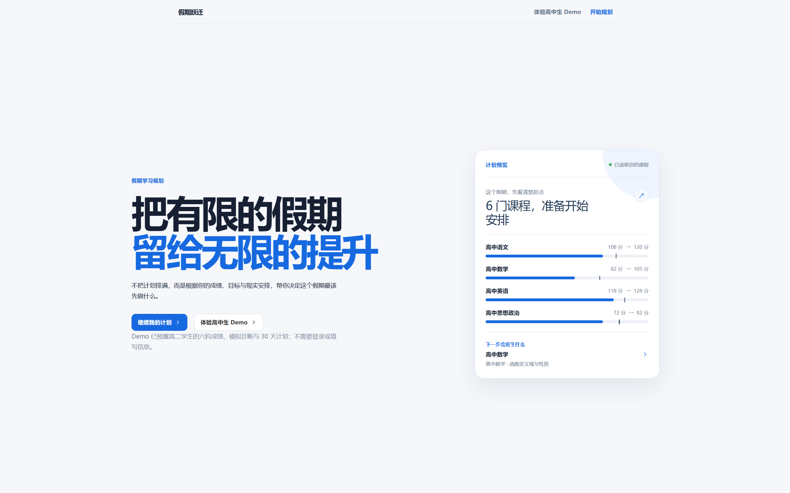
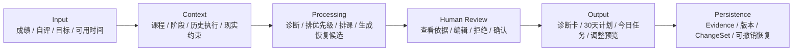
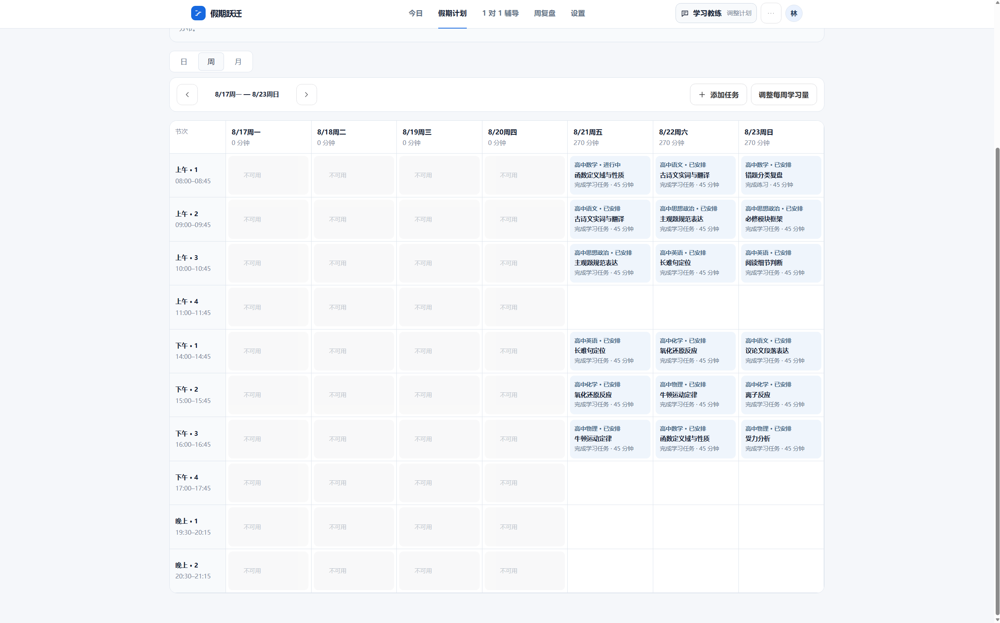

# AI Learning Planner · 假期跃迁

> AI Personal Learning System for turning limited holiday time into an explainable, recoverable plan.

假期跃迁不是普通待办清单。它帮助高中生与大学生理解自己的起点，判断课程优先级，生成可执行的学习计划，并在计划被打断后给出可比较、可撤销的恢复方案。

[Live Demo](https://ai-learning-planner-sepia.vercel.app/plan) · [GitHub](https://github.com/3555489035ppx-wq/ai-learning-planner)



## Live Demo

- 本地演示：<http://localhost:5173/plan>
- 公开地址：[Vercel Demo](https://ai-learning-planner-sepia.vercel.app/plan)

## Project Background

学生的假期通常同时包含低分课程、考试目标、技能提升和现实安排。任务越多，越需要判断什么应该先做、为什么现在做，以及计划失败后怎样继续。普通待办清单能记录任务，却不能解释取舍，也不能保存恢复依据。

## User Problem

**Target users**

- 高中生，尤其是需要补弱或建立学习节奏的学生
- 同时推进多门课程的大学生
- 需要把学习目标拆成可执行路径的产品设计 / 计算机学生

**Core problems**

1. 成绩或自评很难直接转成可行动的学习问题。
2. 多门课程争夺同一段时间，却缺少可解释的优先级。
3. 计划只告诉用户“做什么”，不说明“为什么这样安排”。
4. 旅行、兼职、连续未完成后，任务容易失去上下文。

## Product Goal

把学习规划从任务生成升级为一条可解释、可执行、可恢复的闭环：

```text
学习概况 → 课程诊断 → 优先级 → 学习阶段 / Task Pool → 周课表 → 今日执行 → 学习证据 → 周复盘 → Plan Recovery
```

系统回答两件不同的事：学习阶段决定“学什么”，周课表决定“什么时候学”。用户确认后才会启用计划或应用调整。

## My Design Decisions

### Why not build another todo list?

待办清单只记录任务，不处理课程之间的取舍、诊断置信度和中断后的恢复。假期跃迁把课程、阶段、Task Pool、Placement、Weekly Schedule 和 Evidence 分层，让用户可以看见从判断到执行的关系。

### Why show diagnosis before the schedule?

成绩是起点证据，不是知识点结论。产品先展示当前优势、主要问题、置信度和下一步，再把这些依据带入排程，避免“低分 = 盲目加任务”。

### Why preview before applying changes?

计划调整会影响真实时间，所以系统先展示差异、原因和影响范围；用户确认后才写入，并生成可撤销 ChangeSet（变更集）。

## AI Workflow



当前公开 Demo 使用明确标记的本地规则 provider，不需要 API Key，也不把本地 mock 结果伪装成远程模型判断。真实 AI 接入应通过服务端 provider 完成，并保留同样的输入、上下文、限制、确认和回滚边界。

## Demo

### 1-minute entry

1. Open the [Live Demo](https://ai-learning-planner-sepia.vercel.app/plan).
2. Click **体验高中生 Demo**.
3. The product loads a high-school student, six subjects, differentiated scores, simulated diagnosis, and a 30-day plan.

### Recommended 3-minute flow

1. **课程诊断**：先看数学、英语、物理和政治的差异化结论。
2. **学习计划**：查看阶段、Task Pool 和周课表。
3. **典型一日**：08:00 数学函数基础、10:00 英语阅读训练、14:00 物理力学专题、晚间错题整理；具体节次会根据可用时间和优先级轮换。
4. **今日**：完成或延期任务，并记录实际学习分钟数。
5. **周复盘**：让真实执行证据进入 Plan Recovery，预览并确认下一步调整。

## Product Screens

| Product entry | Explainable plan |
| --- | --- |
|  |  |

The curated screenshot index is in [`docs/screenshots`](docs/screenshots). Automated visual-regression captures remain documented separately and are not used as the first impression.

## Technical Implementation

- React 19, Vite, TypeScript, and React Router
- Local-first persistence with `localStorage`, schema migration, export, and restore
- Diagnosis, planning, scheduling, resources, Evidence, and recovery domains
- Explainable task rationale with score gap, priority, dependencies, and limitations
- Plan drafts, diff preview, activation, version history, and ChangeSet undo
- Responsive desktop/mobile interaction, keyboard paths, focus management, and Playwright coverage

## Portfolio Documents

- [Case Study](docs/case-study.md)
- [Product Story](docs/product-story.md)
- [User Flow](docs/user-flow.md)
- [Design Decisions](docs/design-decision.md)
- [Demo Script](docs/demo-script.md)
- [Engineering notes](docs/portfolio/engineering-notes.md)
- [Test report](docs/portfolio/test-report.md)

## Current Boundary

The current demo has no login, cloud sync, remote AI, or formal learning-outcome evidence. Diagnosis and planning are local rule-based candidates; they do not guarantee scores or exam results. The next meaningful product validation is usability testing followed by longer-term behavior evidence.

## Local Development

Requires Node.js 22.6+ and pnpm.

```bash
corepack enable
pnpm install
pnpm dev
```

Open `http://127.0.0.1:5173/` after the dev server starts. Quality checks:

```bash
pnpm run lint
pnpm run typecheck
pnpm run test:unit
pnpm run test:e2e
pnpm run build
```

## Privacy Boundary

The app stores learning data in the current browser. Do not enter unrelated sensitive information. Read the in-app privacy page before using real student data.
