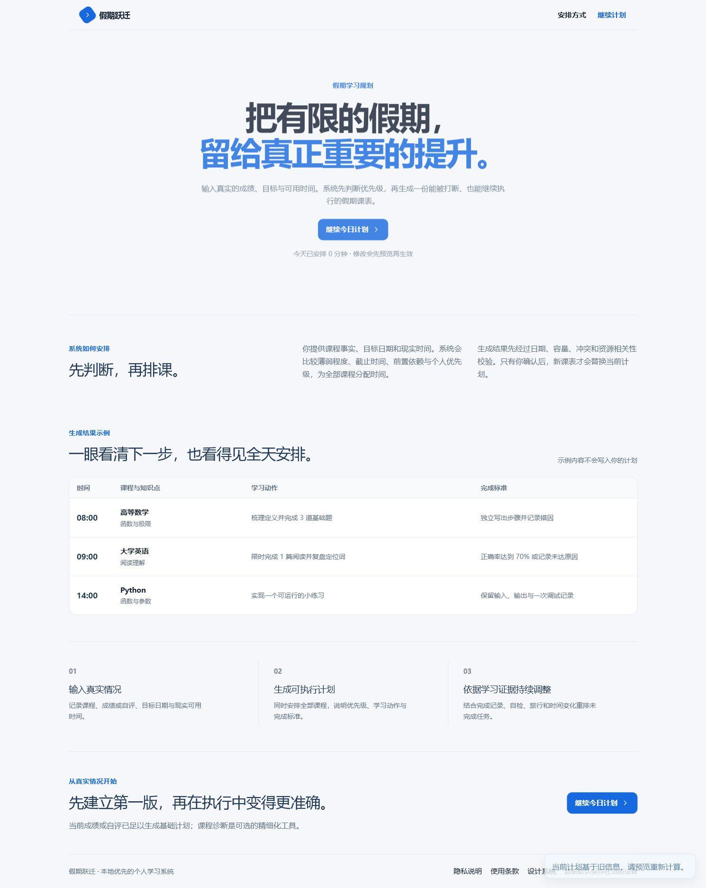
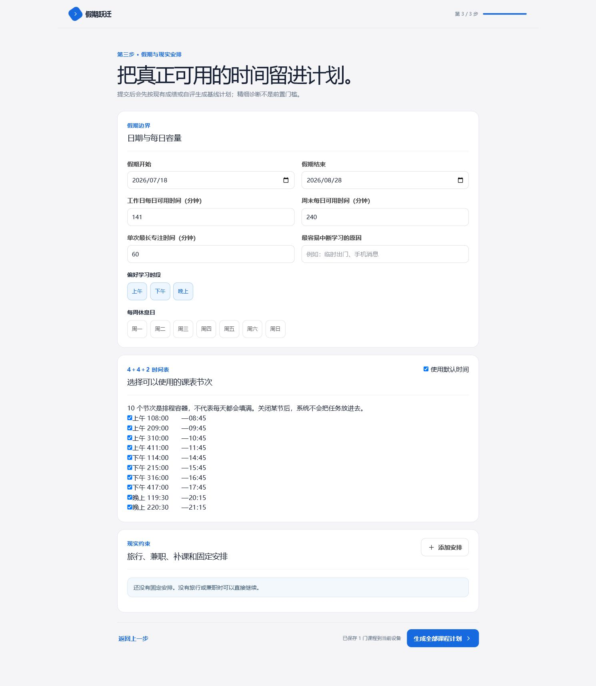
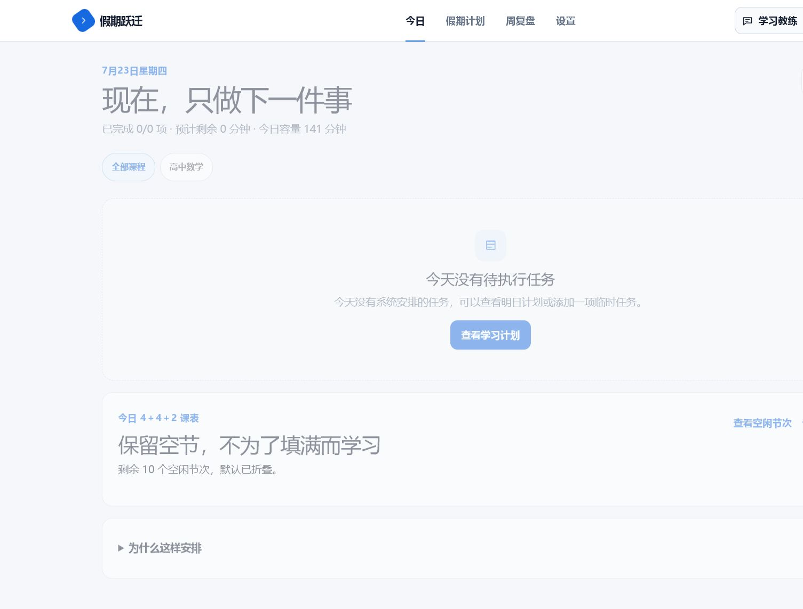
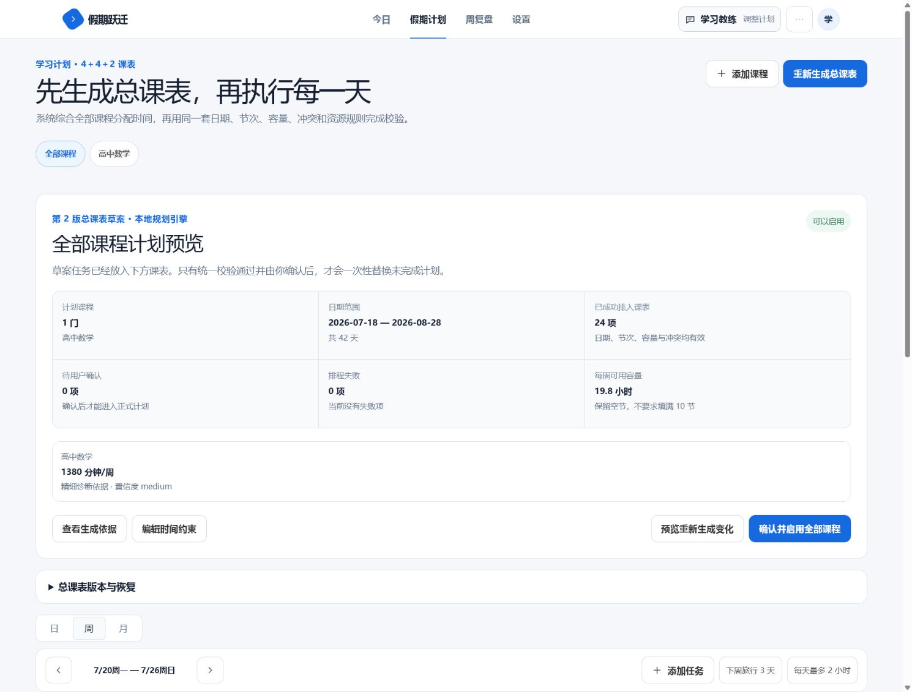
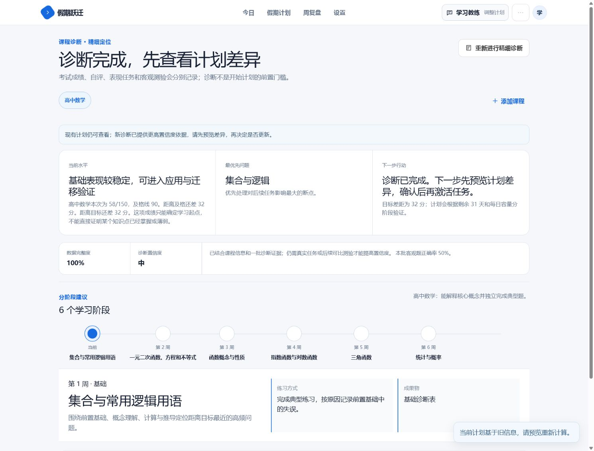
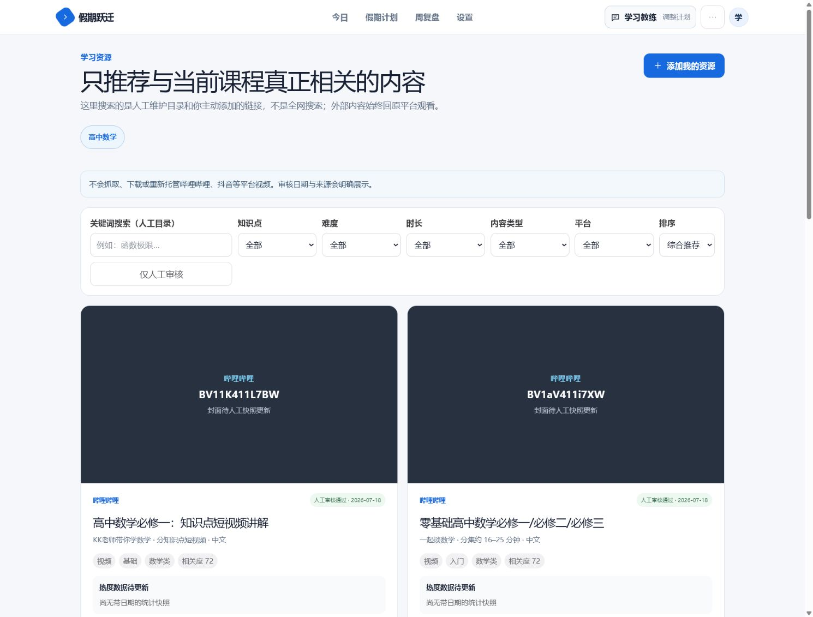
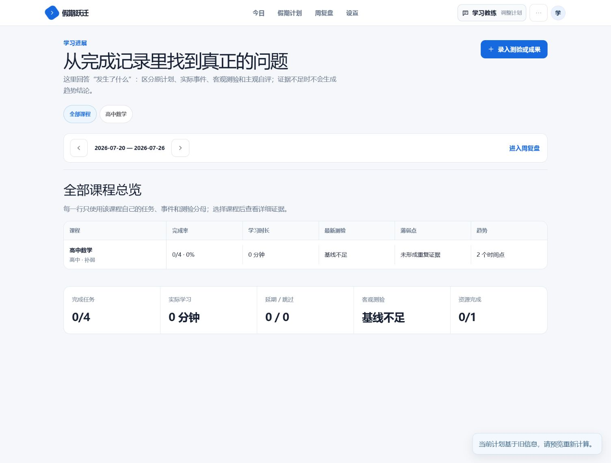
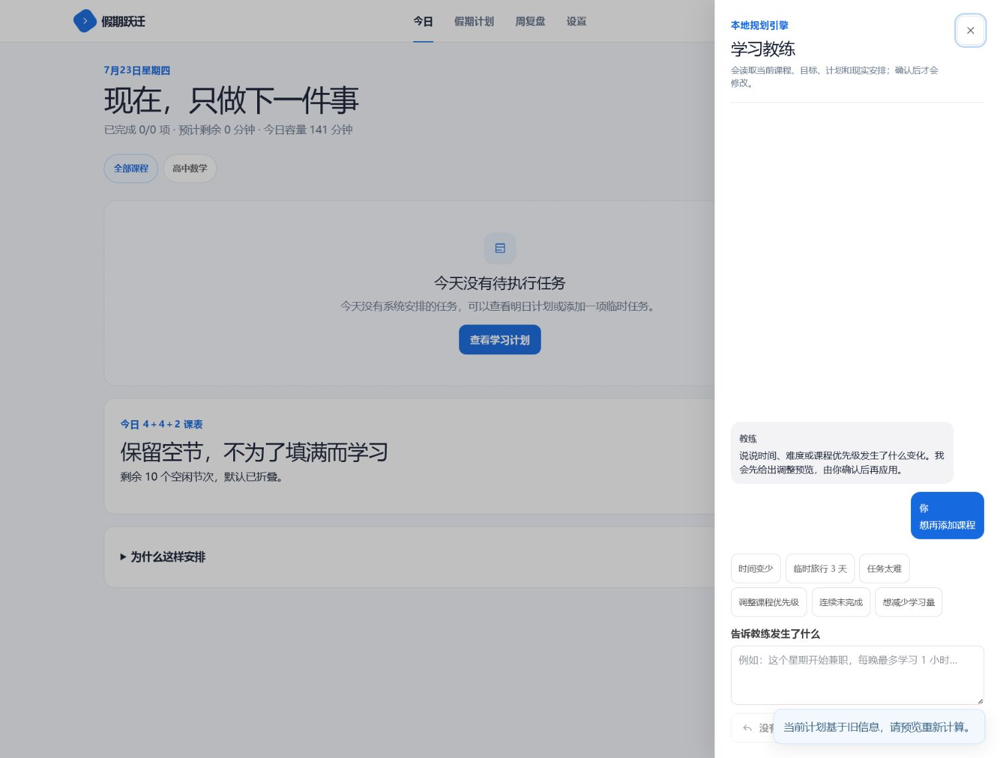

# 假期跃迁 V6｜Codex Sol 现状审计证据

审计日期：2026-07-23  
审计范围：现有可运行前端、核心用户流、桌面端与 390px 移动端  
说明：本目录只记录 Sol 分析证据，不修改业务代码。截图均来自本次审计运行，不复用旧图。

## 结论摘要

当前版本已经不是简单打卡软件：它具备学习档案、全局计划草案、任务事件、诊断版本、ChangeSet、撤销、资源来源声明和周复盘等基础设施。但核心体验仍更像“工程化计划控制台”，而不是学生每天愿意打开的个人学习系统。

最高风险并非视觉，而是语义一致性：计划页显示每周分配 1380 分钟并通过校验，但当前周任务实际仅约 96 分钟，且出现 3 分钟的学习任务尾段。现有校验主要证明“没有时间冲突”，不能证明“计划真的完成了课程预算、阶段目标和学习日覆盖”。

## 逐屏证据

### 01 首页｜可用，但与作品集叙事混在一起

- 健康度：中等。
- 优点：视觉安静，内容真实，没有机器人、渐变光球或夸张 AI 标签。
- 问题：首页承担了产品入口、功能解释、示例计划和作品集叙事，信息过长。
- V6 方向：产品首页只保留一句定位、一个主行动和三步闭环；研究、取舍与系统架构迁移到独立 Case Study。

### 02 学习档案｜数据完整，但首次规划负担过重

- 健康度：中等。
- 优点：课程、日期、可用时间等数据足以支撑真实规划。
- 问题：首次使用即暴露完整 4＋4＋2 时段编辑器，用户在看到计划价值前要完成大量配置。
- V6 方向：先收最小必要信息，系统推荐轻量／标准／冲刺模板；高级时段编辑后置。

### 03 今日｜核心闭环在空状态下断裂

- 健康度：较低。
- 问题：页面显示 0/0 项任务、141 分钟容量和 10 个空时段，但没有解释“为什么今天为空”以及下一步应该做什么。
- V6 方向：空状态必须区分草案待确认、计划已过期、计划明日开始、今日已完成和真实无任务，并提供唯一主行动。

### 04 学习计划｜存在 P0 语义校验缺陷

- 健康度：较低。
- 问题：摘要宣称 19.8 小时/周、24 项任务并通过校验；当前周网格只呈现约 96 分钟，同时出现 3 分钟尾任务。
- 根因方向：`allocationByCourse`、任务展开和当前周日期覆盖的语义没有统一；校验器只检查冲突，不检查预算兑现率、阶段覆盖率和最小可执行时长。
- V6 方向：计划状态只有同时通过结构校验、容量校验、语义校验和可执行性校验，才允许标记“可采用”。

### 05 课程诊断｜结论与标准化成绩冲突

- 健康度：中低。
- 问题：58/150、及格线 90 的成绩被描述为“基础表现较稳定”，与 38.7% 标准化得分明显不一致。
- V6 方向：成绩评价必须基于标准化比例、考试完成状态和考试类型；诊断结论必须带证据引用、置信度与限制说明。

### 06 学习资源｜真实性强，但优先级过高

- 健康度：中等。
- 优点：来源归属、人工审核和不重新托管视频的边界清楚。
- 问题：六组筛选、资源库运营信息和大面积封面占据主体验，而资源只是任务执行的材料。
- V6 方向：聚焦 6 门演示课程；把“为什么推荐、如何更换、是否完成”嵌入具体任务，资源库降为次级入口。

### 07 学习进展｜数据诚实，但没有讲清变化

- 健康度：中等。
- 优点：数据不足时没有伪造趋势。
- 问题：“2 个时间点”和“基线不足”并列，容易让用户误以为已经形成趋势；页面仍以表格与指标为中心。
- V6 方向：首屏先给一句可解释结论，再展示支撑证据；没有可比基线时不展示方向性变化。

### 08 周复盘｜具备证据框架，但调整触发过弱

- 健康度：中等。
- 问题：“存在未完成资源”可被当成调整原因，但资源未完成不等于知识未掌握或计划失效；“证据不足”和预计算的计划变化可能同时出现。
- V6 方向：观察、假设、用户确认原因和调整建议必须分层；弱信号不得直接触发计划变更。

### 09 学习教练｜有确认机制，但还不是恢复系统

- 健康度：中等。
- 优点：说明本地规则引擎，变更需要确认。
- 问题：目前主要是正则指令框和快捷语句，不能主动识别连续中断、解释证据并给出可比较的恢复方案。
- V6 方向：教练入口复用统一 Recovery Engine，输出减少每日负担／延长周期／重排优先级／保持计划四种方案及影响差异。

### 10 设置｜功能存在，但页面价值密度低

- 健康度：中低。
- 问题：大面积空白与单卡片结构显得未完成；学习档案与偏好设置混在同一信息域。
- V6 方向：学习档案成为次级产品页面，设置只管理提醒、资源偏好、数据与隐私。

### 11 移动端今日｜右侧内容被截断

- 健康度：较低。
- 问题：摘要文字与空状态说明在 390px 宽度下截断，核心行动不能完整读取。
- V6 方向：建立真正的单列重排、断行策略、紧凑页头与底部导航安全区，不通过隐藏内容解决溢出。

### 12 移动端计划｜信息密度没有针对窄屏重构

- 健康度：较低。
- 问题：标题和说明右侧裁切，计划控制区堆叠过重，桌面网格没有转换成移动端任务流。
- V6 方向：移动端默认按“阶段／本周／今天”折叠展示，不直接压缩桌面周网格。

## 审计判定

- 产品基础：可保留，已有的数据迁移、版本、ChangeSet、撤销和任务事件是 V6 的资产。
- 核心定位：需要从“自动排程工具”收敛为“基于真实学习证据持续调整计划的个人学习系统”。
- 首要修复：计划语义校验、统一 Evidence、Explainable Planning、Plan Recovery 和 Today 下一步行动。
- 视觉策略：沿用克制的灰白基底，减少控制台式统计和卡片堆叠；Apple Design 只用于反馈、层级、直接操作、可撤销和无障碍，不照抄官网视觉。
