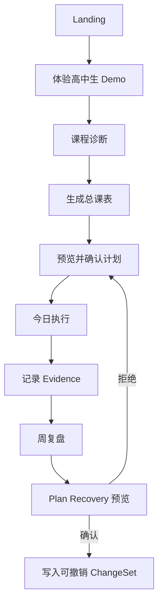

# AI Learning Planner User Flow

## Stage contract

| Stage | Input | Output | User control |
| --- | --- | --- | --- |
| Course diagnosis | score, self-assessment, goal | current strength, problem, confidence, next action | run again, add evidence, read limitations |
| Priority | diagnosis, target, dependencies, deadline | ordered learning focus | change course priority |
| Plan | stages, Task Pool, capacity, timetable | draft and weekly schedule | inspect diff, activate, restore version |
| Today | scheduled task | completion, actual minutes, self-check | start, edit, defer, skip, complete |
| Recovery | execution Evidence, missed tasks, constraints | comparable adjustment candidates | compare, confirm, cancel, undo |

## Failure states

- Incomplete course data: ask for the missing score or self-assessment.
- Low-confidence diagnosis: keep the baseline plan available and suggest a small diagnostic step.
- Capacity conflict: keep the task in Task Pool instead of pretending the schedule is complete.
- Interrupted plan: preserve task intent and propose a reversible adjustment.
- No verified resource: show an honest empty state or a user-provided link path.
